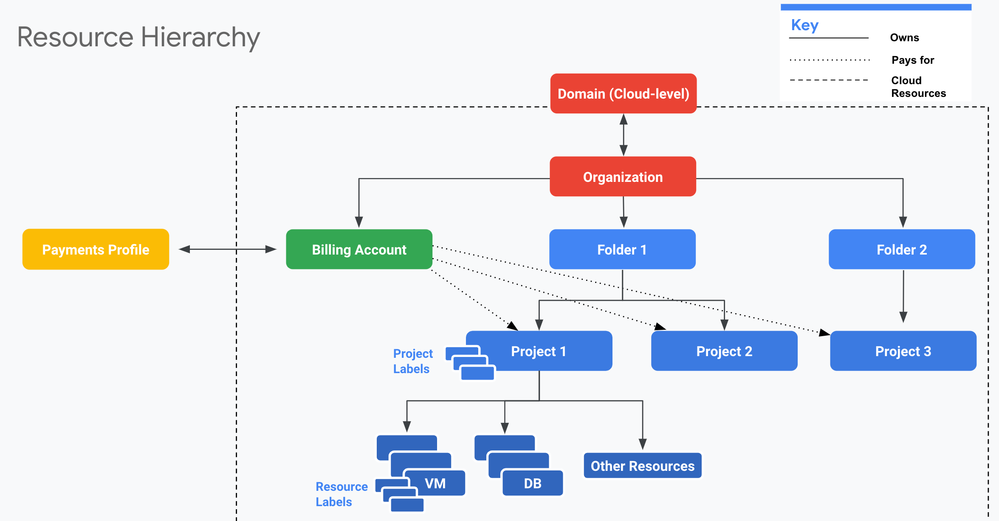
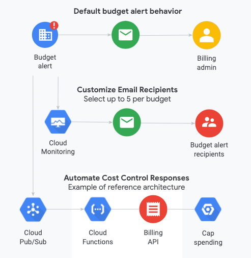

### Cloud Billingの概要

- ドメイン
  - 組織の上にある概念
  - Google Workspaceやcloud identityにリンクしている
  - GCP利用ユーザを管理
  - 組織は一つのドメインに関連付けられている
- ラベル
  - Key-Valueのペア
  - 各リソースにラベルを設定してフィルタリング可能
- cloud請求先アカウント (Billing Account)
  - IAMロールによって確立される
  - projectに紐づけられる
  - Payment profileに紐づけられる
- お支払いプロファイル (Payment Profile)
  - 名前、住所、クレカなどの情報を保管
  - 個人や法人、地域なども保持

※Payment Profileのみ、Domainの外にあるので注意

### Cloud Billing アクセス制御の概要
- Billingのロール
  - 請求先アカウント作成者
    - Billing Accountの作成
  - 請求先アカウント管理者
    - アカウントの管理のみ、オーナーロール
  - 請求先アカウントユーザ
    - プロジェクトを請求先アカウントにリンクする作業ができる
  - 請求先アカウント閲覧者
    - 利用額などの情報を閲覧可能
    - トランザクションも見れる
  - プロジェクト支払い管理者
    - プロジェクととアカウントのリンクや解除ができる

- 役割の管理する場所
  - プロジェクトの支払い管理者のみ、IAMから設定可能
  - ほかのロールは「お支払い」のアカウント管理から設定する　（注意点）

### 予算とアラート

- 料金を1箇所でモリタリングし、想定外の請求が発生する事態を回避
- 基準を超えた場合にも、**サービスの仕様や課金が自動的に停止しない**
  - ただし、通知の仕組みを利用して基準を超えたときに自動的にプロジェクトを停止することは可能

- 一つのバジェットごとに5アカウントまでメール飛ばせる
- Cloud Pub/Subを使ってコストを自動でコントロールすることはできる

### 請求データのBig Queryエクスポート
- [参考](https://cloud.google.com/billing/docs/how-to/export-data-bigquery?hl=ja)
- Cloud Billingのエクスポート機能でbig queryに書き出すことができる
  - 通常のダッシュボードでは詳しい情報は見れない
  - 自動で排出
- Cloud Storageへのファイル出力は非推奨

- 標準的な使用料表
  - project, location, cost, currency,...などなど
  - リソースレベル(VMなど)の課金額も見れる

- 使用方法
  - 「APIとサービスの有効化」から「BigQuery Data Transfer API」を有効化する
- Google data portalでデータを視覚化することができる
