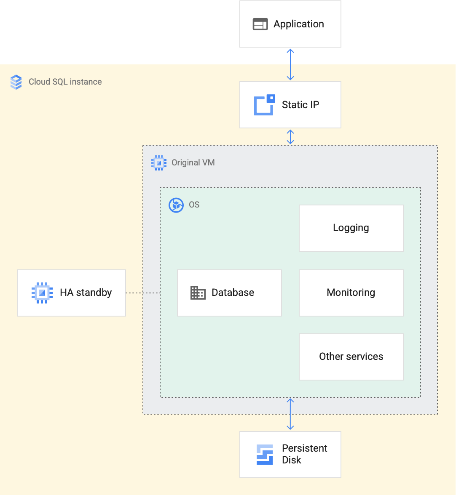

### Cloud SQLの概要
- フルマネージドなSQL
  - MySQL, MySQL Server, PostgreSQL
  - 99.5%を超える可用性を維持
- GCE, GAE, GKEなど様々なアプリのバックエンド
- Cloud SQLインスタンスの物理実態
  - VMとディスクが裏で動いていtる

- CloudSQLの料金
  - 課金対象
    - プロビジョニングしたストレージの量
    - インスタンスのCPUの数
    - メモリ量
    - 固定IPアドレスの数
    - etc...
  - SQLServerの料金は別途かかる

---

### CloudSQLインスタンスの作成
- MySQLのportは3306番ポート
- 接続するには承認済みネットワークを指定する必要がある
  - CIDR表記で指定して上げる必要がある
  - 例えば自分のIPが123.123.32.19の場合、123.123.32.0/24というように指定してあげる必要がある
- アクセスするには`Cloud SQL Auth Proxy`を使用するのが良い
